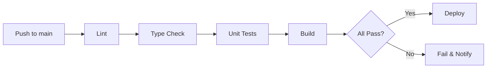

# Deployment

## Development

```bash
# Install dependencies
npm install

# Set up environment
cp .env.example .env
# Edit .env with ALPHA_VANTAGE_API_KEY and JWT_SECRET

# Initialize data directory
npm run setup:data

# Start development servers (frontend + backend concurrently)
npm run dev
```

- Frontend dev server: `http://localhost:5173` (Vite, proxies API to backend)
- Backend dev server: `http://localhost:3001`
- Vite proxy: `/api` requests forwarded to backend

## Production Build

```bash
# Build frontend
cd client && npm run build

# Build backend
cd server && npm run build

# Start production server (serves static frontend + API)
npm start
```

The production Express server serves `client/dist/` as static files and handles API routes. A single process, single port.

## CI/CD Pipeline (GitHub Actions)



### Workflow: `.github/workflows/ci.yml`

```yaml
name: CI
on:
  push:
    branches: [main]
  pull_request:
    branches: [main]

jobs:
  build-and-test:
    runs-on: ubuntu-latest
    steps:
      - uses: actions/checkout@v4
      - uses: actions/setup-node@v4
        with:
          node-version: '20'
          cache: 'npm'
      - run: npm ci
      - run: npm run lint
      - run: npm run typecheck
      - run: npm test -- --coverage
      - run: npm run build
```

## Environment Variables

| Variable | Required | Description |
|----------|:--------:|-------------|
| `ALPHA_VANTAGE_API_KEY` | Yes | Alpha Vantage API key |
| `JWT_SECRET` | Yes | Secret for signing JWT tokens |
| `PORT` | No | Server port (default: 3001) |
| `NODE_ENV` | No | `development` or `production` |

## .gitignore Entries

```
node_modules/
dist/
.env
data/cache/
data/benchmark/
```

Note: `data/holdings/`, `data/settings.json`, and `data/audit/` are committed (private repo). Cache and benchmark data are ephemeral and gitignored.

## Hosting Options

The application is a standard Node.js server. Compatible hosting options:

| Platform | Tier | Notes |
|----------|------|-------|
| Railway | Free/Hobby | Simple deploy from GitHub |
| Render | Free | Auto-deploy from GitHub |
| Fly.io | Free | Container-based, good perf |
| VPS (any) | Varies | Full control, run with PM2 |
| Self-hosted | Free | Docker or direct Node.js |

## Monitoring (MVP)

- **Application**: console.log for errors (structured JSON in production)
- **Health check**: `GET /api/health` returns `{ "status": "ok", "timestamp": "..." }`
- **Data freshness**: admin dashboard shows last refresh timestamp
- **No external monitoring** for MVP — add in v2 if needed

## Operational Considerations

- **Backup**: Git history provides data backup (private repo with data/ committed)
- **Rollback**: `git revert` or `git reset` to restore prior data state
- **Data migration**: not applicable (no database schema to migrate)
- **Scaling**: single-process is sufficient for single-user MVP
- **Secrets rotation**: change JWT_SECRET in env, all active sessions invalidated
