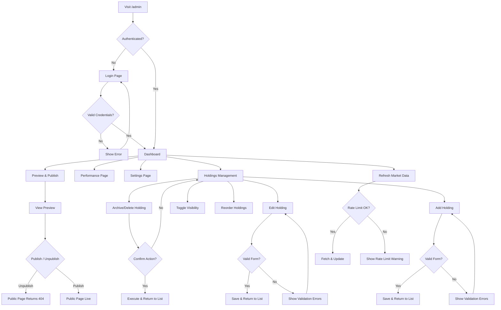
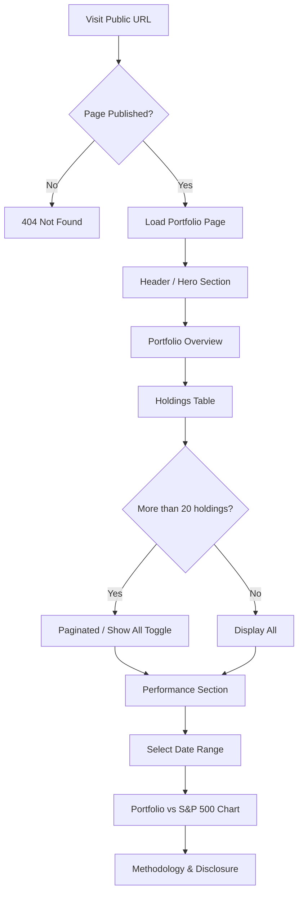

# Information Architecture

## Sitemap

```
/                           Public Portfolio Page (if published)
/login                      Admin Login
/admin                      Admin Dashboard
/admin/holdings             Holdings Management (table)
/admin/holdings/new         Add Holding Form
/admin/holdings/:ticker/edit Edit Holding Form
/admin/performance          Performance & Benchmark
/admin/transactions         Transaction History (all holdings)
/admin/settings             Portfolio Settings
/admin/preview              Public Page Preview + Publish Control
```

## Navigation Structure

### Admin Navigation (Sidebar)

```
[Logo / Portfolio Title]
--------------------------
Dashboard          /admin
Holdings           /admin/holdings
Performance        /admin/performance
Transactions       /admin/transactions
Settings           /admin/settings
Preview & Publish  /admin/preview
--------------------------
[Logout]
```

### Public Page Navigation (Single-page scrolling)

```
[Portfolio Title]
--------------------------
Overview           #overview
Holdings           #holdings
Performance        #performance
Methodology        #methodology
```

## Admin User Flow



## Public User Flow


