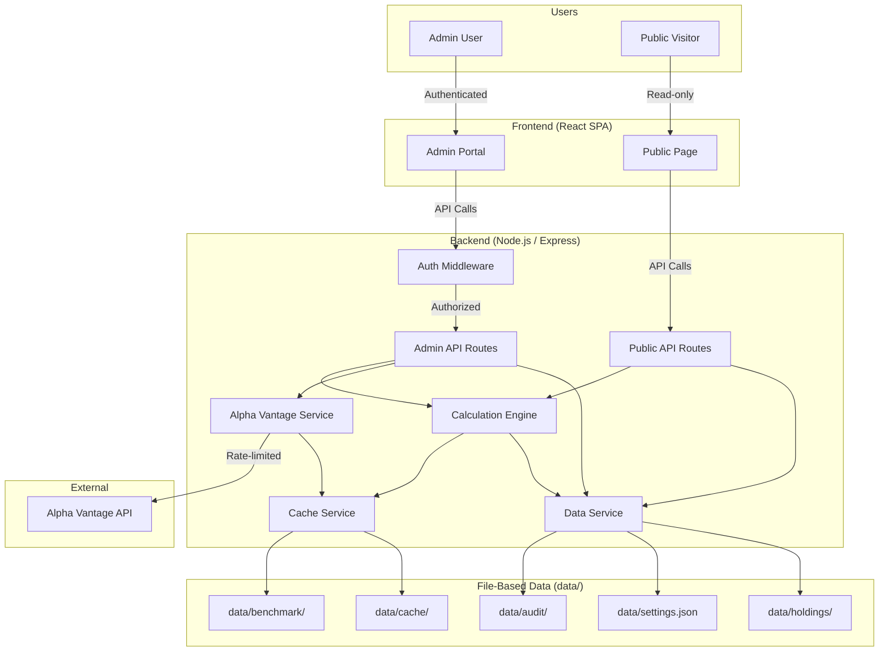
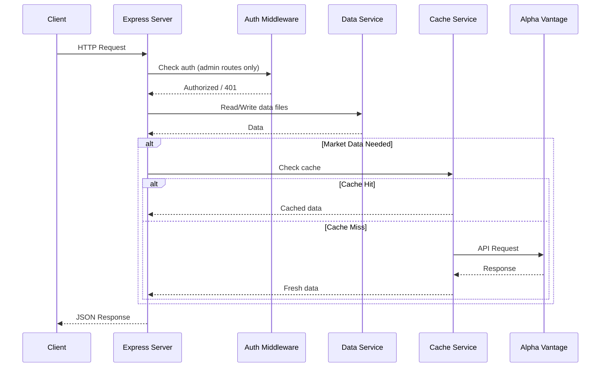

# System Architecture

## Architecture Diagram

## High-Level Design

The application follows a **client-server architecture** with a React SPA frontend and a Node.js/Express backend. Data is persisted as JSON files in a `data/` directory. Market data is fetched from Alpha Vantage and cached locally.

### Layers

1. **Frontend (React)**: SPA with client-side routing. Admin portal and public page share the same build but have separate route trees. The admin routes are protected by authentication.

2. **Backend (Express)**: RESTful API server that handles data operations, Alpha Vantage integration, and return calculations. All API keys are server-side only.

3. **Data Layer (File System)**: JSON files in `data/` directory. No database server. Git provides version history.

4. **External (Alpha Vantage)**: Third-party API for market data. Accessed server-side only through the cache service.

### Request Flow

## Deployment Architecture

- **Development**: `npm run dev` starts both frontend (Vite dev server) and backend (Express) concurrently
- **Production build**: Frontend compiles to static files, served by Express
- **Hosting**: Any Node.js hosting (e.g., Railway, Render, Fly.io, or self-hosted)
- **CI/CD**: GitHub Actions — lint, test, build, deploy
- **Environment**: `.env` file for API keys and secrets (never committed)
