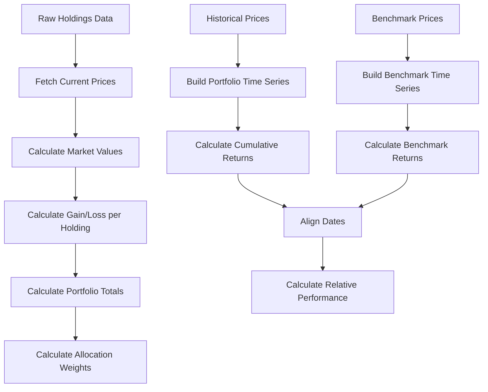

# Return Calculations

## Calculation Flow



## Per-Holding Calculations

### Market Value
```
marketValue = quantity * currentPrice
```

### Total Cost (Cost Basis)
```
totalCost = quantity * averageCost
```

### Gain/Loss
```
gainLoss = marketValue - totalCost
gainLossPercent = (gainLoss / totalCost) * 100
```

### Example
```
Holding: AAPL
  quantity: 50
  averageCost: $150.25
  currentPrice: $178.50

  totalCost     = 50 * 150.25  = $7,512.50
  marketValue   = 50 * 178.50  = $8,925.00
  gainLoss      = 8,925 - 7,512.50 = $1,412.50
  gainLossPercent = (1,412.50 / 7,512.50) * 100 = 18.80%
```

## Portfolio-Level Calculations

### Total Portfolio Value
```
totalValue = SUM(marketValue) for all active holdings
```

### Total Portfolio Cost
```
totalCost = SUM(quantity * averageCost) for all active holdings
```

### Total Gain/Loss
```
totalGainLoss = totalValue - totalCost
totalGainLossPercent = (totalGainLoss / totalCost) * 100
```

### Allocation Weight (per holding)
```
weight = (marketValue / totalValue) * 100

Constraint: SUM(weight) = 100% (within floating-point tolerance of 0.01%)
```

> [!note] Weight (allocation percentage) is what the public page shows. Quantity is never exposed publicly.

### Daily Change
```
dailyChange = SUM(quantity * priceChange) for all active holdings
dailyChangePercent = (dailyChange / previousTotalValue) * 100
```

Where `priceChange` is the difference between today's close and yesterday's close for each holding.

## Portfolio Time Series (for charts)

To build a portfolio value time series for performance charting:

1. For each trading day in the range:
   a. For each holding active on that date (purchaseDate <= date):
      - Look up the holding's close price on that date
      - Compute: `holdingValue = quantity * closePrice`
   b. Sum all holding values: `portfolioValue[date] = SUM(holdingValues)`
2. Calculate cumulative return from start date:
```
cumulativeReturn[date] = (portfolioValue[date] - portfolioValue[startDate]) / portfolioValue[startDate] * 100
```

### Holdings with Different Purchase Dates

- A holding only contributes to the portfolio value on and after its purchase date
- Before its purchase date, its value is zero (not included in the sum)
- This means the portfolio composition changes over time as new holdings are added
- The start date for the overall portfolio is the earliest purchase date among active holdings

## Benchmark Comparison

### Relative Performance
```
relativePerformance = portfolioReturn - benchmarkReturn
```

- Positive: portfolio outperformed the benchmark
- Negative: portfolio underperformed the benchmark

### Time Period Alignment
- Both portfolio and benchmark returns are calculated over the same date range
- Start date: earliest purchase date (or user-selected start)
- End date: today (or user-selected end)
- Both series use the same set of trading days (intersection)

## Edge Cases

| Scenario | Handling |
|----------|---------|
| Holding purchased today | Market value = quantity * purchase price; gain/loss = 0 |
| No current price (cache miss + rate limited) | Use last cached price; show "stale" indicator |
| Price = 0 or null | Exclude from calculations; show warning |
| All holdings archived | Total value = 0; return = 0; empty state in UI |
| Weekend/holiday purchase date | Use next trading day's close for initial value |
| Fractional shares | Full decimal precision; display rounded to 2 places |
| Very small allocation | Show as "< 0.1%" rather than 0.0% |

## Precision and Rounding

- All intermediate calculations use full floating-point precision
- Display rounding:
  - Currency: 2 decimal places ($1,234.56)
  - Percentages: 2 decimal places (12.34%)
  - Weight: 1 decimal place (25.3%)
- Allocation weights are normalized to sum exactly to 100% after rounding
- Return accuracy target: within +/- 0.01% of manual spreadsheet verification
