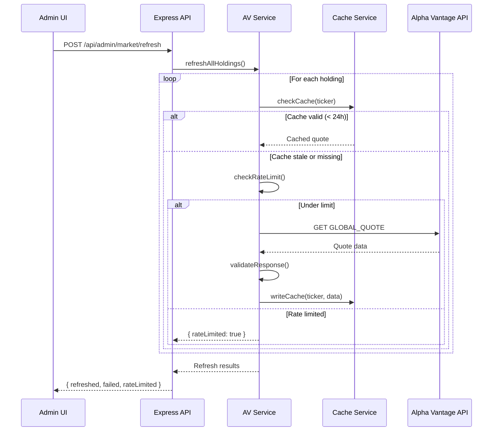

# Alpha Vantage Service

## Overview

The Alpha Vantage service handles all external market data operations. It manages API calls, rate limiting, caching, and data normalization. All Alpha Vantage access is server-side only.

## API Endpoints Used

| Endpoint | Function | Usage |
|----------|----------|-------|
| `SYMBOL_SEARCH` | `searchSymbol(query)` | Ticker validation when adding holdings |
| `GLOBAL_QUOTE` | `getQuote(ticker)` | Current price for a single holding |
| `TIME_SERIES_DAILY` | `getDailyTimeSeries(ticker, outputsize)` | Historical prices for performance charts |

## Integration Flow



## Rate Limit Strategy

Alpha Vantage free tier: **25 requests per day**, **5 per minute**.

| Strategy | Implementation |
|----------|---------------|
| Request counting | Track daily and per-minute call counts in memory |
| Proactive checking | Before each request, check if limits would be exceeded |
| Batching | When refreshing all holdings, process sequentially with 12s delays between calls |
| Cache-first | Always check cache before making an API call |
| Graceful degradation | If rate limited, return last cached data with a stale warning |
| User feedback | Show rate limit status in admin UI (calls remaining, next reset time) |

```typescript
interface RateLimitState {
  dailyCount: number;
  dailyResetAt: string;      // ISO date (midnight ET)
  minuteCount: number;
  minuteResetAt: string;     // ISO timestamp
}
```

## Response Validation

Every Alpha Vantage response is validated before use:

1. **Check for error messages**: AV returns `{ "Error Message": "..." }` for invalid symbols
2. **Check for rate limit notes**: `{ "Note": "...premium..." }` indicates rate limiting
3. **Check for data presence**: ensure expected fields exist
4. **Type validation**: ensure numeric fields are parseable numbers
5. **Staleness check**: verify `latestTradingDay` is recent (within 3 trading days)

## Data Normalization

### Quote Data
```typescript
interface NormalizedQuote {
  symbol: string;
  price: number;
  change: number;
  changePercent: number;
  volume: number;
  latestTradingDay: string;   // YYYY-MM-DD
  fetchedAt: string;          // ISO timestamp
}
```

Raw AV response keys like `"05. price"` are mapped to clean field names.

### Time Series Data
```typescript
interface NormalizedTimeSeries {
  symbol: string;
  fetchedAt: string;
  data: Array<{
    date: string;             // YYYY-MM-DD
    open: number;
    high: number;
    low: number;
    close: number;
    volume: number;
  }>;
}
```

## Symbol Validation

When adding a new holding:
1. Call `SYMBOL_SEARCH` with the entered ticker
2. Filter results for exact ticker match
3. If found: return company name, asset type, region
4. If not found: return validation error
5. If rate limited: allow the user to proceed with manual entry and a warning

## Error Handling

| Error Type | Response | User Experience |
|-----------|----------|-----------------|
| Invalid API key | 500, log error | "Market data service unavailable" |
| Rate limited | 429, return cached | "Rate limit reached. Showing cached data from [time]." |
| Invalid symbol | 404 | "Symbol not found" |
| Network error | 500, return cached | "Unable to reach market data service. Showing cached data." |
| Malformed response | 500, log + return cached | "Data processing error. Showing cached data." |
| Missing data for date | Skip date | Gap in chart (handled by frontend) |

## Caching Implementation

- **Cache directory**: `data/cache/quotes/` and `data/cache/search/`
- **Cache key**: `{TICKER}.json`
- **TTL**: 24 hours for quotes, 7 days for symbol search results
- **Eviction**: on read, check `fetchedAt` age; if stale, fetch fresh data
- **Manual eviction**: `cacheService.evictExpired()` clears all stale entries
